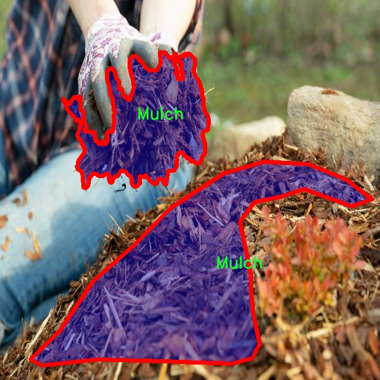

# 草莓病害分割系统源码＆数据集分享
 [yolov8-seg-LAWDS＆yolov8-seg-bifpn等50+全套改进创新点发刊_一键训练教程_Web前端展示]

### 1.研究背景与意义

项目参考[ILSVRC ImageNet Large Scale Visual Recognition Challenge](https://gitee.com/YOLOv8_YOLOv11_Segmentation_Studio/projects)

项目来源[AAAI Global Al lnnovation Contest](https://kdocs.cn/l/cszuIiCKVNis)

研究背景与意义

草莓作为一种广受欢迎的水果，因其独特的风味和丰富的营养价值而备受青睐。然而，草莓的种植面临着多种病害的威胁，这些病害不仅影响了草莓的产量和品质，还对农民的经济收入造成了显著影响。根据相关研究，草莓病害的发生率逐年上升，给农业生产带来了严峻的挑战。因此，及时、准确地识别和处理草莓病害显得尤为重要。传统的病害识别方法依赖于人工观察，受限于人类的主观判断和经验，往往难以做到高效和准确。为此，基于计算机视觉和深度学习技术的自动化病害检测系统应运而生，成为解决这一问题的有效手段。

在众多深度学习模型中，YOLO（You Only Look Once）系列因其高效的实时目标检测能力而备受关注。YOLOv8作为该系列的最新版本，具备了更强的特征提取能力和更快的处理速度，能够在复杂的环境中实现高精度的目标检测和分割。针对草莓病害的实例分割任务，YOLOv8的改进版本将为病害的精准识别提供有力支持。通过对草莓病害进行实例分割，不仅可以识别出病害的种类，还能精确定位病害在植物上的分布情况，从而为后续的防治措施提供科学依据。

本研究基于一个包含1900张图像的草莓病害数据集，涵盖了11个不同的类别，包括Angular Leafspot、Anthracnose Fruit Rot、Blossom Blight、Gray Mold等。这些类别的多样性使得模型在训练过程中能够学习到不同病害的特征，从而提高模型的泛化能力和识别准确率。数据集中还包括健康草莓和非可食用草莓的样本，为模型提供了更全面的背景信息，增强了模型对各种情况的适应能力。

通过改进YOLOv8模型，本研究旨在构建一个高效的草莓病害分割系统，以实现对草莓病害的自动检测和分类。这一系统的成功实现，将为农业生产提供重要的技术支持，帮助农民及时发现和处理病害，降低经济损失。同时，该系统的应用还将推动智能农业的发展，提高农业生产的自动化和智能化水平。

总之，基于改进YOLOv8的草莓病害分割系统的研究，不仅具有重要的理论意义，也具有广泛的实际应用价值。通过这一研究，我们期望能够为草莓种植提供一种高效、准确的病害识别工具，助力农业可持续发展，推动智能农业的进步。

### 2.图片演示


##### 注意：由于此博客编辑较早，上面“2.图片演示”和“3.视频演示”展示的系统图片或者视频可能为老版本，新版本在老版本的基础上升级如下：（实际效果以升级的新版本为准）

  （1）适配了YOLOV8的“目标检测”模型和“实例分割”模型，通过加载相应的权重（.pt）文件即可自适应加载模型。

  （2）支持“图片识别”、“视频识别”、“摄像头实时识别”三种识别模式。

  （3）支持“图片识别”、“视频识别”、“摄像头实时识别”三种识别结果保存导出，解决手动导出（容易卡顿出现爆内存）存在的问题，识别完自动保存结果并导出到tempDir中。

  （4）支持Web前端系统中的标题、背景图等自定义修改，后面提供修改教程。

  另外本项目提供训练的数据集和训练教程,暂不提供权重文件（best.pt）,需要您按照教程进行训练后实现图片演示和Web前端界面演示的效果。

### 3.视频演示

[3.1 视频演示](https://www.bilibili.com/video/BV1vY2mYUEBz/)

### 4.数据集信息展示

##### 4.1 本项目数据集详细数据（类别数＆类别名）

nc: 11
names: ['Angular Leafspot', 'Anthracnose Fruit Rot', 'Blossom Blight', 'Gray Mold', 'Healthy-Leaf -Strawberry', 'Healthy-Strawberry', 'Leaf Spot', 'Mulch', 'Powdery Mildew Fruit', 'Powdery Mildew Leaf', 'non-edible-Strawberry']


##### 4.2 本项目数据集信息介绍

数据集信息展示

在现代农业中，草莓作为一种重要的经济作物，其健康状况直接影响到产量和品质。因此，针对草莓病害的及时检测与处理显得尤为重要。为此，我们构建了一个名为“Strawberry Disease”的数据集，旨在为改进YOLOv8-seg的草莓病害分割系统提供强有力的支持。该数据集包含11个类别，涵盖了草莓常见的病害类型及健康状态，能够为深度学习模型的训练提供丰富的样本。

在数据集中，首先，"Angular Leafspot"（角斑病）是一种常见的草莓叶片病害，主要表现为叶片上出现不规则的角状斑点，严重时会导致叶片枯萎，影响光合作用。其次，"Anthracnose Fruit Rot"（炭疽果腐病）是草莓果实的一种致命病害，导致果实腐烂，严重影响市场价值。接下来是"Blossom Blight"（花腐病），该病害主要影响草莓的花朵，导致花朵凋谢，进而影响果实的形成。

此外，"Gray Mold"（灰霉病）是草莓种植中最为常见的病害之一，尤其在潮湿环境下更为严重，导致果实和叶片表面出现灰色霉层，影响草莓的外观和食用安全。与之相对的是"Healthy-Leaf -Strawberry"（健康叶片草莓）和"Healthy-Strawberry"（健康草莓），这两个类别为数据集提供了健康状态的对照样本，有助于模型在识别病害时更准确地判断健康与否。

数据集中还包括"Leaf Spot"（叶斑病），该病害表现为叶片上出现小斑点，影响光合作用和植物生长。值得注意的是，"Mulch"（覆盖物）类别的加入，旨在帮助模型区分病害与覆盖物之间的关系，提升分割的准确性。此外，"Powdery Mildew Fruit"（果粉病）和"Powdery Mildew Leaf"（叶粉病）分别针对草莓果实和叶片的白色粉状病害进行分类，反映了草莓在不同生长阶段可能遭遇的病害。

最后，"non-edible-Strawberry"（非食用草莓）类别则为数据集提供了一个额外的维度，帮助模型识别那些由于病害或其他原因不适合食用的草莓。这一类别的存在，不仅丰富了数据集的多样性，也为后续的病害检测和分类提供了更为全面的视角。

通过“Strawberry Disease”数据集的构建，我们希望能够为草莓病害的自动检测与分割提供坚实的基础。该数据集的多样性和丰富性，将为YOLOv8-seg模型的训练提供充足的样本支持，提升其在实际应用中的表现。最终，借助这一数据集，期望能够实现草莓病害的高效识别与精准管理，为农业生产的可持续发展贡献力量。




### 5.全套项目环境部署视频教程（零基础手把手教学）

[5.1 环境部署教程链接（零基础手把手教学）](https://www.bilibili.com/video/BV1jG4Ve4E9t/?vd_source=bc9aec86d164b67a7004b996143742dc)


[5.2 安装Python虚拟环境创建和依赖库安装视频教程链接（零基础手把手教学）](https://www.bilibili.com/video/BV1nA4VeYEze/?vd_source=bc9aec86d164b67a7004b996143742dc)

### 6.手把手YOLOV8-seg训练视频教程（零基础小白有手就能学会）

[6.1 手把手YOLOV8-seg训练视频教程（零基础小白有手就能学会）](https://www.bilibili.com/video/BV1cA4VeYETe/?vd_source=bc9aec86d164b67a7004b996143742dc)


按照上面的训练视频教程链接加载项目提供的数据集，运行train.py即可开始训练



     Epoch   gpu_mem       box       obj       cls    labels  img_size
     1/200     0G   0.01576   0.01955  0.007536        22      1280: 100%|██████████| 849/849 [14:42<00:00,  1.04s/it]
               Class     Images     Labels          P          R     mAP@.5 mAP@.5:.95: 100%|██████████| 213/213 [01:14<00:00,  2.87it/s]
                 all       3395      17314      0.994      0.957      0.0957      0.0843

     Epoch   gpu_mem       box       obj       cls    labels  img_size
     2/200     0G   0.01578   0.01923  0.007006        22      1280: 100%|██████████| 849/849 [14:44<00:00,  1.04s/it]
               Class     Images     Labels          P          R     mAP@.5 mAP@.5:.95: 100%|██████████| 213/213 [01:12<00:00,  2.95it/s]
                 all       3395      17314      0.996      0.956      0.0957      0.0845

     Epoch   gpu_mem       box       obj       cls    labels  img_size
     3/200     0G   0.01561    0.0191  0.006895        27      1280: 100%|██████████| 849/849 [10:56<00:00,  1.29it/s]
               Class     Images     Labels          P          R     mAP@.5 mAP@.5:.95: 100%|███████   | 187/213 [00:52<00:00,  4.04it/s]
                 all       3395      17314      0.996      0.957      0.0957      0.0845


### 7.50+种全套YOLOV8-seg创新点代码加载调参视频教程（一键加载写好的改进模型的配置文件）

[7.1 50+种全套YOLOV8-seg创新点代码加载调参视频教程（一键加载写好的改进模型的配置文件）](https://www.bilibili.com/video/BV1Hw4VePEXv/?vd_source=bc9aec86d164b67a7004b996143742dc)

### 8.YOLOV8-seg图像分割算法原理

原始YOLOv8-seg算法原理

YOLOv8-seg算法是YOLO系列中的最新版本，结合了目标检测与语义分割的优势，旨在实现高效且精确的图像理解。该算法的设计理念源于YOLO（You Only Look Once）系列的单阶段检测框架，强调实时性与高精度的平衡。YOLOv8-seg在YOLOv8的基础上进行了改进，特别是在特征提取、特征融合和输出模块的设计上，增强了对复杂场景的适应能力，尤其是在处理小目标和背景复杂的图像时。

YOLOv8-seg的网络结构主要由四个部分组成：输入模块、Backbone骨干网络、Neck特征融合网络和Head检测模块。输入模块负责对输入图像进行预处理，包括图像的缩放、裁剪和增强等操作。通过Mosaic增强技术，YOLOv8-seg能够生成多样化的训练样本，提升模型的泛化能力。输入图像的自适应缩放和灰度填充确保了输入数据的一致性，为后续的特征提取打下了良好的基础。

在Backbone部分，YOLOv8-seg采用了DarkNet结构，并引入了C2f模块以替代传统的C3模块。C2f模块通过优化通道数和特征流动，能够更有效地捕捉图像中的细节信息，尤其是在处理不同尺度的目标时，表现出更强的适应性。SPPF模块的引入进一步增强了特征图的表达能力，通过多种尺寸的池化操作合并特征图，确保了不同层次特征的丰富性。这种设计使得YOLOv8-seg在面对复杂背景时，能够更好地提取出目标的特征，提升了检测和分割的精度。

Neck部分采用了双塔结构，结合了特征金字塔网络（FPN）和路径聚合网络（PAN），实现了高效的特征融合。特征金字塔网络通过多尺度特征的上采样和下采样，确保了不同层次特征的有效传递，而路径聚合网络则增强了语义信息与定位信息的结合。这种特征融合策略不仅提升了对小目标的检测能力，也增强了模型对复杂场景的理解能力，使得YOLOv8-seg在多种应用场景中都能保持高效的性能。

在Head模块中，YOLOv8-seg采用了解耦头的结构，将分类和回归任务分开处理。通过这种解耦设计，模型能够更灵活地调整分类和定位的策略，从而加速收敛并提高精度。检测模块包含三个独立的检测器，分别负责不同类别的目标检测和分割任务。这种结构的优势在于可以针对不同任务进行专门的优化，提升了整体的检测效率和准确性。

值得注意的是，YOLOv8-seg在处理小目标时表现出色，尤其是在复杂水面环境下，能够有效识别和分割小目标漂浮物。为了进一步提升小目标的检测能力，YOLOv8-seg引入了更小的检测头，增强了对小目标的感知力。此外，Neck端的GSConv和Slim-neck技术的应用，确保了在降低计算量的同时，保持了模型的精度。这些改进使得YOLOv8-seg在实际应用中能够更好地应对各种挑战，尤其是在目标检测和语义分割的结合上，展现出强大的潜力。

在损失函数的设计上，YOLOv8-seg采用了多种损失计算策略，包括二元交叉熵损失（BCE）和分布焦点损失（DFL），结合了CIoU损失函数以提高模型的泛化能力和精准度。这种多样化的损失计算方式，使得模型在训练过程中能够更好地适应不同的任务需求，提升了整体的性能。

总的来说，YOLOv8-seg算法通过优化网络结构、增强特征提取与融合能力、改进检测模块以及多样化损失函数设计，展现出在目标检测与语义分割领域的强大能力。其高效的推理速度和优越的检测精度，使其成为当前图像理解任务中的一种重要工具，尤其在复杂场景下的应用前景广阔。随着YOLOv8-seg的不断发展与完善，未来在更多实际应用中，其潜力将进一步被挖掘，推动计算机视觉领域的进步与创新。


### 9.系统功能展示（检测对象为举例，实际内容以本项目数据集为准）

图9.1.系统支持检测结果表格显示

  图9.2.系统支持置信度和IOU阈值手动调节

  图9.3.系统支持自定义加载权重文件best.pt(需要你通过步骤5中训练获得)

  图9.4.系统支持摄像头实时识别

  图9.5.系统支持图片识别

  图9.6.系统支持视频识别

  图9.7.系统支持识别结果文件自动保存

  图9.8.系统支持Excel导出检测结果数据


### 10.50+种全套YOLOV8-seg创新点原理讲解（非科班也可以轻松写刊发刊，V11版本正在科研待更新）

#### 10.1 由于篇幅限制，每个创新点的具体原理讲解就不一一展开，具体见下列网址中的创新点对应子项目的技术原理博客网址【Blog】：


[10.1 50+种全套YOLOV8-seg创新点原理讲解链接](https://gitee.com/qunmasj/good)

#### 10.2 部分改进模块原理讲解(完整的改进原理见上图和技术博客链接)【如果此小节的图加载失败可以通过CSDN或者Github搜索该博客的标题访问原始博客，原始博客图片显示正常】
### YOLOv8简介
YOLOv8目标检测算法继承了YOLOv1系列的思考,是一种新型端到端的目标检测算法,尽管现在原始检测算法已经开源,但是鲜有发表的相关论文.YOLOv8的网络结构如图所示,主要可分为Input输入端、Backbone骨干神经网络、Neck 混合特征网络层和Head预测层网络共4个部分.

YOLO目标检测算法是一种端到端的One-Slage 目标检测算法，其核心思想是将图像按区域分块进行预测。YOLO将输入图像按照32x32的大小划分成若干个网格，例如416x416的图像将被划分为13x13个网格。当目标物体的中心位于某个网格内时,该网格就会负责输出该物体的边界框和类别置信度。每个网格可以预测多个边界框和多个目标类别,这些边界框和类别的数量可以根据需要进行设置。YOLO算法的输出是一个特征图,包含了每个网格对应的边界框和类别置信度的信息呵。本文采用YOLO最新的YOLOv8模型，其是2022年底发布的最新YOLO系列模型，采用全新的SOTA模型，全新的网络主干结构,如图1所示。
整个网络分为Backbone 骨干网络部分和Head头部网络部分。YOLOv8汲取了前几代网络的优秀特性，骨干网络和 Neck部分遵循CSP的思想，将YOLOv5中的C3模块被替换成了梯度流更丰富C2模块,去掉YOLOv5中 PAN-FPN上采样阶段中的卷积结构,将Backbone不同阶段输出的特征直接送入了上采样操作,模型提供了N/S/M/L/X尺度的不同大小模型,能够满足不同领域业界的需求。本文基于YOLOv8模型设计番茄病虫害检测系统，通过配置模型参数训练番茄图像,得到能够用于部署应用的最优模型。


### 感受野注意力卷积（RFAConv)
#### 标准卷积操作回顾
标准的卷积操作是构造卷积神经网络的基本构件。它利用具有共享参数的滑动窗口提取特征信息，克服了全连通层构造神经网络固有的参数多、计算开销大的问题。设 X R∈C×H×W
表示输入特征图，其中C、H、W分别表示特征图的通道数、高度、宽度。为了清楚地演示卷积核的特征提取过程，我们使用 C = 1 的例子。从每个接受域滑块中提取特征信息的卷积运算可以表示为:


这里，Fi 表示计算后每个卷积滑块得到的值，Xi 表示每个滑块内对应位置的像素值，K表示卷积核，S表示卷积核中的参数个数，N表示接收域滑块的总数。可以看出，每个滑块内相同位置的 feature共享相同的参数Ki。因此，标准的卷积运算并不能捕捉到不同位置所带来的信息差异，这最终在一定程度上限制了卷积神经网络的性能。 

#### 空间注意力回顾
目前，空间注意机制是利用学习得到的注意图来突出每个特征的重要性。与前一节类似，这里以 C=1为例。突出关键特征的空间注意机制可以简单表述为:这里，Fi 表示加权运算后得到的值。xi 和Ai 表示输入特征图和学习到的注意图在不同位置的值，N为输入特征图的高和宽的乘积，表示像素值的总数。


#### 空间注意与标准卷积运算
将注意力机制整合到卷积神经网络中，可以提高卷积神经网络的性能。通过对标准卷积运算和现有空间注意机制的研究，我们认为空间注意机制有效地克服了卷积神经网络固有的参数共享的局限性。目前卷积神经网络中最常用的核大小是 1 × 1和3 × 3。在引入空间注意机制后，提取特征的卷积操作可以是 1 × 1或3 × 3卷积操作。为了直观地展示这个过程，在 1 × 1卷积运算的前面插入了空间注意机制。通过注意图对输入特征图(Re-weight“×”)进行加权运算，最后通过 1 × 1卷积运算提取接收域的滑块特征信息。整个过程可以简单地表示如下:


 这里卷积核K仅代表一个参数值。如果取A i× ki 的值作为一种新的卷积核参数，有趣的是它解决了 1×1卷积运算提取特征时的参数共享问题。然而，关于空间注意机制的传说到此结束。当空间注意机制被插入到3×3卷积运算前面时。具体情况如下:


如上所述，如果取A的值 i × ki (4)式作为一种新的卷积核参数，完全解决了大规模卷积核的参数共享问题。然而，最重要的一点是，卷积核在提取每个接受域滑块的特征时，会共享一些特征。换句话说，每个接收域滑块内都有一个重叠。仔细分析后会发现A12= a21， a13 = a22， a15 = a24……，在这种情况下，每个滑动窗口共享空间注意力地图的权重。因此，空间注意机制没有考虑整个接受域的空间特征，不能有效地解决大规模卷积核的参数共享问题。因此，空间注意机制的有效性受到限制。 

#### 创新空间注意力和标准卷积操作
该博客提出解决了现有空间注意机制的局限性，为空间处理提供了一种创新的解决方案。受RFA的启发，一系列空间注意机制被开发出来，可以进一步提高卷积神经网络的性能。RFA可以看作是一个轻量级即插即用模块，RFA设计的卷积运算(RFAConv)可以代替标准卷积来提高卷积神经网络的性能。因此，我们预测空间注意机制与标准卷积运算的结合将继续发展，并在未来带来新的突破。
接受域空间特征:为了更好地理解接受域空间特征的概念，我们将提供相关的定义。接收域空间特征是专门为卷积核设计的，并根据核大小动态生成。如图1所示，以3×3卷积核为例。在图1中，“Spatial Feature”指的是原始的Feature map。“接受域空间特征”是空间特征变换后的特征图。

 

由不重叠的滑动窗口组成。当使用 3×3卷积内核提取特征时，接收域空间特征中的每个 3×3大小窗口代表一个接收域滑块。接受域注意卷积(RFAConv):针对接受域的空间特征，我们提出了接受域注意卷积(RFA)。该方法不仅强调了接收域滑块内不同特征的重要性，而且对接收域空间特征进行了优先排序。通过该方法，完全解决了卷积核参数共享的问题。接受域空间特征是根据卷积核的大小动态生成的，因此，RFA是卷积的固定组合，不能与卷积操作的帮助分离，卷积操作同时依赖于RFA来提高性能，因此我们提出了接受场注意卷积(RFAConv)。具有3×3大小的卷积核的RFAConv整体结构如图所示。


目前，最广泛使用的接受域特征提取方法是缓慢的。经过大量的研究，我们开发了一种快速的方法，用分组卷积来代替原来的方法。具体来说，我们利用相应大小的分组卷积来动态生成基于接受域大小的展开特征。尽管与原始的无参数方法(如PyTorch提供的nn.())相比，该方法增加了一些参数，但它的速度要快得多。注意:如前一节所述，当使用 3×3卷积内核提取特征时，接收域空间特征中的每个 3×3大小窗口表示一个接收域滑块。而利用快速分组卷积提取感受野特征后，将原始特征映射为新的特征。最近的研究表明。交互信息可以提高网络性能，如[40,41,42]所示。同样，对于RFAConv来说，通过交互接受域特征信息来学习注意图可以提高网络性能。然而，与每个接收域特征交互会导致额外的计算开销，因此为了最小化计算开销和参数的数量，我们使用AvgPool来聚合每个接收域特征的全局信息。然后，使用 1×1 组卷积操作进行信息交互。最后，我们使用softmax来强调每个特征在接受域特征中的重要性。一般情况下，RFA的计算可以表示为:


这里gi×i 表示一个大小为 i×i的分组卷积，k表示卷积核的大小，Norm表示归一化，X表示输入的特征图，F由注意图 a相乘得到 rf 与转换后的接受域空间特征 Frf。与CBAM和CA不同，RFA能够为每个接受域特征生成注意图。卷积神经网络的性能受到标准卷积操作的限制，因为卷积操作依赖于共享参数，对位置变化带来的信息差异不敏感。然而，RFAConv通过强调接收域滑块中不同特征的重要性，并对接收域空间特征进行优先级排序，可以完全解决这个问题。通过RFA得到的feature map是接受域空间特征，在“Adjust Shape”后没有重叠。因此，学习到的注意图将每个接受域滑块的特征信息聚合起来。换句话说，注意力地图不再共享在每个接受域滑块。这完全弥补了现有 CA和CBAM注意机制的不足。RFA为标准卷积内核提供了显著的好处。而在调整形状后，特征的高度和宽度是 k倍，需要进行 stride = k的k × k卷积运算来提取特征信息。RFA设计的卷积运算RFAConv为卷积带来了良好的增益，对标准卷积进行了创新。
此外，我们认为现有的空间注意机制应该优先考虑接受域空间特征，以提高网络性能。众所周知，基于自注意机制的网络模型[43,44,45]取得了很大的成功，因为它解决了卷积参数共享的问题，并对远程信息进行建模。然而，自注意机制也为模型引入了显著的计算开销和复杂性。我们认为，将现有的空间注意机制的注意力引导到接受场空间特征上，可以以类似于自我注意的方式解决长期信息的参数共享和建模问题。与自我关注相比，这种方法需要的参数和计算资源少得多。答案如下:(1)将以接收场空间特征为中心的空间注意机制与卷积相结合，消除了卷积参数共享的问题。(2)现有的空间注意机制已经考虑了远程信息，可以通过全局平均池或全局最大池的方式获取全局信息，其中明确考虑了远程信息。因此，我们设计了新的 CBAM和CA模型，称为RFCBAM和RFCA，它们专注于接受域空间特征。与RFA类似，使用最终的k × k stride = k 的卷积运算来提取特征信息。这两种新的卷积方法的具体结构如图 3所示，我们称这两种新的卷积操作为 RFCBAMConv和RFCAConv。与原来的CBAM相比，我们在RFCBAM中使用SE attention来代替CAM。因为这样可以减少计算开销。此外，在RFCBAM中，通道注意和空间注意不是分开执行的。相反，它们是同时加权的，使得每个通道获得的注意力地图是不同的。


### 11.项目核心源码讲解（再也不用担心看不懂代码逻辑）

#### 11.1 ui.py

以下是经过精简和注释的核心代码部分：

```python
import sys
import subprocess
from QtFusion.path import abs_path

def run_script(script_path):
    """
    使用当前 Python 环境运行指定的脚本。

    Args:
        script_path (str): 要运行的脚本路径
    """
    # 获取当前 Python 解释器的路径
    python_path = sys.executable

    # 构建运行命令，使用 streamlit 运行指定的脚本
    command = f'"{python_path}" -m streamlit run "{script_path}"'

    # 执行命令并等待其完成
    result = subprocess.run(command, shell=True)
    
    # 检查命令执行结果，如果返回码不为0，则表示出错
    if result.returncode != 0:
        print("脚本运行出错。")

# 主程序入口
if __name__ == "__main__":
    # 获取脚本的绝对路径
    script_path = abs_path("web.py")

    # 运行指定的脚本
    run_script(script_path)
```

### 代码分析和注释：
1. **导入模块**：
   - `sys`：用于访问与 Python 解释器相关的变量和函数。
   - `subprocess`：用于执行外部命令。
   - `abs_path`：从 `QtFusion.path` 导入的函数，用于获取文件的绝对路径。

2. **`run_script` 函数**：
   - 该函数接受一个脚本路径作为参数，并使用当前 Python 环境来运行该脚本。
   - `python_path = sys.executable`：获取当前 Python 解释器的路径，以确保使用正确的 Python 版本。
   - `command`：构建要执行的命令字符串，使用 `streamlit` 运行指定的脚本。
   - `subprocess.run(command, shell=True)`：执行构建的命令，并等待其完成。
   - 检查命令的返回码，如果不为0，则输出错误信息。

3. **主程序入口**：
   - `if __name__ == "__main__":`：确保该代码块仅在直接运行脚本时执行，而不是作为模块导入时执行。
   - `script_path = abs_path("web.py")`：获取 `web.py` 脚本的绝对路径。
   - `run_script(script_path)`：调用 `run_script` 函数来运行指定的脚本。

这个文件名为 `ui.py`，它的主要功能是运行一个指定的 Python 脚本，具体来说是通过 Streamlit 框架来启动一个 Web 应用。文件中首先导入了必要的模块，包括 `sys`、`os` 和 `subprocess`，这些模块提供了与系统交互的功能。

在 `run_script` 函数中，首先获取当前 Python 解释器的路径，这样可以确保在正确的环境中运行脚本。接着，构建一个命令字符串，该命令使用当前的 Python 解释器和 Streamlit 模块来运行指定的脚本。命令的格式是 `python -m streamlit run script_path`，其中 `script_path` 是要运行的脚本的路径。

使用 `subprocess.run` 方法来执行这个命令，并通过 `shell=True` 参数在 shell 中运行命令。执行后，函数会检查返回的状态码，如果返回码不为零，表示脚本运行过程中出现了错误，程序会打印出“脚本运行出错”的提示。

在文件的最后部分，使用 `if __name__ == "__main__":` 语句来确保当该文件作为主程序运行时才会执行以下代码。这里指定了要运行的脚本路径，调用 `abs_path` 函数获取 `web.py` 的绝对路径，然后调用 `run_script` 函数来启动这个脚本。

总的来说，这个 `ui.py` 文件的作用是提供一个简单的接口来运行一个名为 `web.py` 的 Streamlit 应用，确保在正确的 Python 环境中执行，并处理可能出现的错误。

#### 11.2 ultralytics\models\yolo\pose\__init__.py

以下是代码中最核心的部分，并附上详细的中文注释：

```python
# 导入所需的模块
from .predict import PosePredictor  # 导入姿态预测器类
from .train import PoseTrainer      # 导入姿态训练器类
from .val import PoseValidator       # 导入姿态验证器类

# 定义模块的公开接口
__all__ = 'PoseTrainer', 'PoseValidator', 'PosePredictor'  # 指定可以被外部访问的类
```

### 代码详细注释：

1. **导入模块**：
   - `from .predict import PosePredictor`：从当前包的 `predict` 模块中导入 `PosePredictor` 类，该类负责姿态的预测功能。
   - `from .train import PoseTrainer`：从当前包的 `train` 模块中导入 `PoseTrainer` 类，该类用于训练姿态模型。
   - `from .val import PoseValidator`：从当前包的 `val` 模块中导入 `PoseValidator` 类，该类用于验证姿态模型的性能。

2. **定义公开接口**：
   - `__all__ = 'PoseTrainer', 'PoseValidator', 'PosePredictor'`：这是一个特殊的变量，用于定义当使用 `from module import *` 语句时，哪些类或函数是可以被导入的。在这里，只有 `PoseTrainer`、`PoseValidator` 和 `PosePredictor` 这三个类会被导入，其他未列出的类或函数将不会被导入。这样可以控制模块的公开接口，避免不必要的名称冲突。

这个程序文件是一个Python模块的初始化文件，位于Ultralytics YOLO项目的pose子模块中。文件的第一行是一个注释，表明该项目使用的是AGPL-3.0许可证，并且是Ultralytics YOLO的一个部分。

接下来的几行代码导入了三个类：`PosePredictor`、`PoseTrainer`和`PoseValidator`。这些类分别负责姿态预测、姿态训练和姿态验证的功能。通过这种方式，用户可以在其他地方直接使用这些类，而不需要关心它们的具体实现细节。

最后，`__all__`变量定义了模块的公共接口，列出了可以被外部导入的名称。在这个文件中，`__all__`包含了三个类的名称，意味着当使用`from ultralytics.models.yolo.pose import *`这样的语句时，只会导入这三个类。

总的来说，这个文件的主要作用是组织和管理pose模块中的核心功能，使得其他模块或用户能够方便地使用这些功能。

#### 11.3 ultralytics\hub\session.py

以下是代码中最核心的部分，并附上详细的中文注释：

```python
import signal
import sys
from pathlib import Path
from time import sleep
import requests
from ultralytics.hub.utils import HUB_API_ROOT, HUB_WEB_ROOT, smart_request
from ultralytics.utils import LOGGER, is_colab

AGENT_NAME = f'python-{__version__}-colab' if is_colab() else f'python-{__version__}-local'

class HUBTrainingSession:
    """
    HUBTrainingSession类用于管理Ultralytics HUB YOLO模型的训练会话，包括模型初始化、心跳检测和检查点上传等功能。
    """

    def __init__(self, url):
        """
        初始化HUBTrainingSession，使用提供的模型标识符。

        参数:
            url (str): 用于初始化HUB训练会话的模型标识符，可以是URL字符串或特定格式的模型键。

        异常:
            ValueError: 如果提供的模型标识符无效。
            ConnectionError: 如果连接全局API密钥不被支持。
        """
        # 解析输入的模型URL
        if url.startswith(f'{HUB_WEB_ROOT}/models/'):
            url = url.split(f'{HUB_WEB_ROOT}/models/')[-1]
        if [len(x) for x in url.split('_')] == [42, 20]:
            key, model_id = url.split('_')
        elif len(url) == 20:
            key, model_id = '', url
        else:
            raise ValueError(f"模型='{url}'未找到。请检查格式是否正确，例如 "
                             f"模型='{HUB_WEB_ROOT}/models/MODEL_ID'，然后重试。")

        # 授权
        auth = Auth(key)
        self.model_id = model_id
        self.model_url = f'{HUB_WEB_ROOT}/models/{model_id}'
        self.api_url = f'{HUB_API_ROOT}/v1/models/{model_id}'
        self.auth_header = auth.get_auth_header()
        self.metrics_queue = {}  # 存储模型的指标
        self.model = self._get_model()  # 获取模型数据
        self.alive = True  # 表示心跳循环是否处于活动状态
        self._start_heartbeat()  # 启动心跳检测
        self._register_signal_handlers()  # 注册信号处理器
        LOGGER.info(f'查看模型在 {self.model_url} 🚀')

    def _get_model(self):
        """从Ultralytics HUB获取并返回模型数据。"""
        api_url = f'{HUB_API_ROOT}/v1/models/{self.model_id}'
        try:
            response = smart_request('get', api_url, headers=self.auth_header, thread=False)
            data = response.json().get('data', None)

            if data.get('status', None) == 'trained':
                raise ValueError('模型已经训练并上传到 HUB。')

            if not data.get('data', None):
                raise ValueError('数据集可能仍在处理。请稍等片刻再试。')

            self.model_id = data['id']  # 更新模型ID

            # 根据模型状态设置训练参数
            if data['status'] == 'new':
                self.train_args = {
                    'batch': data['batch_size'],
                    'epochs': data['epochs'],
                    'imgsz': data['imgsz'],
                    'patience': data['patience'],
                    'device': data['device'],
                    'cache': data['cache'],
                    'data': data['data']}
                self.model_file = data.get('cfg') or data.get('weights')
            elif data['status'] == 'training':
                self.train_args = {'data': data['data'], 'resume': True}
                self.model_file = data['resume']

            return data
        except requests.exceptions.ConnectionError as e:
            raise ConnectionRefusedError('错误: HUB服务器未在线。请稍后再试。') from e

    @threaded
    def _start_heartbeat(self):
        """开始一个线程的心跳循环，向Ultralytics HUB报告代理的状态。"""
        while self.alive:
            r = smart_request('post',
                              f'{HUB_API_ROOT}/v1/agent/heartbeat/models/{self.model_id}',
                              json={'agent': AGENT_NAME},
                              headers=self.auth_header)
            sleep(300)  # 每300秒发送一次心跳
```

### 代码说明：
1. **导入必要的库**：导入了处理信号、路径、时间、HTTP请求等所需的库。
2. **AGENT_NAME**：根据运行环境（Colab或本地）设置代理名称。
3. **HUBTrainingSession类**：主要用于管理Ultralytics HUB的训练会话。
   - **初始化方法**：解析模型标识符，进行授权，获取模型数据，启动心跳检测。
   - **_get_model方法**：从HUB获取模型数据，并根据模型状态设置训练参数。
   - **_start_heartbeat方法**：在一个独立线程中定期向HUB发送心跳信号，报告代理的状态。

这个程序文件是一个用于管理Ultralytics HUB中YOLO模型训练会话的Python类，名为`HUBTrainingSession`。它的主要功能包括模型初始化、心跳信号的发送以及模型检查点的上传。

在初始化时，构造函数接收一个模型标识符`url`，并解析该标识符以获取模型的密钥和ID。如果提供的标识符格式不正确，程序会抛出一个自定义的异常`HUBModelError`。接着，程序会通过`Auth`类进行身份验证，并构建与Ultralytics HUB的API交互所需的各种URL和请求头。

该类的属性包括与模型相关的信息，如`model_id`、`model_url`、`api_url`等，以及用于管理API调用速率的限制和计时器。初始化完成后，程序会启动一个心跳机制，定期向Ultralytics HUB发送状态更新，以保持与服务器的连接。

在程序中，`_register_signal_handlers`方法用于注册信号处理器，以便在接收到终止信号时能够优雅地关闭心跳机制并退出程序。`_handle_signal`方法处理这些信号，确保在Colab环境中终止后不会继续发送心跳信号。

`upload_metrics`方法用于将模型的性能指标上传到Ultralytics HUB，`_get_model`方法则从HUB获取模型数据，检查模型的状态并返回相关信息。`upload_model`方法用于上传模型的检查点，包括当前训练的epoch、权重文件以及是否是最佳模型等信息。

最后，`_start_heartbeat`方法在一个单独的线程中运行，定期向HUB发送心跳请求，报告代理的状态。这一机制确保了训练会话的持续性和稳定性。

整体而言，这个类为YOLO模型的训练过程提供了一个完整的管理框架，使得用户能够方便地与Ultralytics HUB进行交互。

#### 11.4 ultralytics\engine\predictor.py

以下是经过简化和注释的核心代码部分，主要关注于YOLO模型的预测过程。

```python
import platform
from pathlib import Path
import cv2
import numpy as np
import torch
from ultralytics.cfg import get_cfg, get_save_dir
from ultralytics.data import load_inference_source
from ultralytics.nn.autobackend import AutoBackend
from ultralytics.utils import LOGGER, callbacks, select_device, smart_inference_mode

class BasePredictor:
    """
    BasePredictor类用于创建YOLO模型的预测器。
    """

    def __init__(self, cfg=None, overrides=None, _callbacks=None):
        """
        初始化BasePredictor类。

        Args:
            cfg (str, optional): 配置文件路径，默认为None。
            overrides (dict, optional): 配置覆盖，默认为None。
        """
        self.args = get_cfg(cfg, overrides)  # 获取配置
        self.save_dir = get_save_dir(self.args)  # 获取保存结果的目录
        self.model = None  # 模型初始化为None
        self.dataset = None  # 数据集初始化为None
        self.callbacks = _callbacks or callbacks.get_default_callbacks()  # 获取回调函数

    def preprocess(self, im):
        """
        对输入图像进行预处理。

        Args:
            im (torch.Tensor | List(np.ndarray)): 输入图像，支持张量或列表格式。
        """
        if not isinstance(im, torch.Tensor):
            im = np.stack(im)  # 将输入转换为张量
            im = im[..., ::-1].transpose((0, 3, 1, 2))  # 转换颜色通道
            im = torch.from_numpy(im).to(self.device)  # 转换为张量并移动到设备上
        return im.half() if self.model.fp16 else im.float()  # 转换数据类型

    def inference(self, im):
        """使用模型对图像进行推理。"""
        return self.model(im)  # 返回模型的推理结果

    def stream_inference(self, source=None, model=None):
        """实时流推理，处理摄像头输入并保存结果。"""
        self.setup_model(model)  # 设置模型
        self.setup_source(source)  # 设置数据源

        for batch in self.dataset:  # 遍历数据集
            im0s = batch[1]  # 获取原始图像
            im = self.preprocess(im0s)  # 预处理图像
            preds = self.inference(im)  # 进行推理
            # 处理推理结果...
            yield preds  # 返回推理结果

    def setup_model(self, model):
        """初始化YOLO模型并设置为评估模式。"""
        self.model = AutoBackend(model)  # 创建模型实例
        self.model.eval()  # 设置模型为评估模式

    def setup_source(self, source):
        """设置数据源，加载数据集。"""
        self.dataset = load_inference_source(source)  # 加载数据集

# 使用示例
predictor = BasePredictor(cfg='path/to/config.yaml')
for result in predictor.stream_inference(source='video.mp4'):
    # 处理每一帧的结果
    pass
```

### 代码说明：
1. **BasePredictor类**：这是一个基础类，用于实现YOLO模型的预测功能。
2. **__init__方法**：初始化类的属性，包括配置、保存目录、模型和数据集等。
3. **preprocess方法**：对输入图像进行预处理，包括颜色通道转换和数据类型转换。
4. **inference方法**：使用YOLO模型对预处理后的图像进行推理。
5. **stream_inference方法**：实现实时流推理，处理来自摄像头或视频文件的输入。
6. **setup_model和setup_source方法**：分别用于初始化模型和设置数据源。

以上代码展示了YOLO模型的基本预测流程，涵盖了模型的初始化、数据预处理、推理和结果处理等核心功能。

这个程序文件是Ultralytics YOLO（You Only Look Once）目标检测框架中的一个预测器类，主要用于对图像、视频、流媒体等进行推理（预测）。文件中包含了多个方法和属性，用于处理输入数据、执行推理、后处理结果、保存输出等。

首先，文件开头部分提供了使用说明，包括支持的输入源（如摄像头、图像文件、视频文件、目录、YouTube链接等）和模型格式（如PyTorch、ONNX、TensorRT等）。这些信息为用户提供了如何使用该预测器的基本指导。

`BasePredictor`类是该文件的核心，包含了多个属性和方法。属性包括配置参数、模型、设备、数据集、视频路径、视频写入器等。初始化方法`__init__`中，通过`get_cfg`函数获取配置，并设置保存结果的目录、置信度阈值等。

`preprocess`方法用于在推理前对输入图像进行预处理，包括调整图像格式、归一化等。`inference`方法则是实际执行推理的地方，调用模型进行预测。`postprocess`方法用于对模型输出的结果进行后处理。

`__call__`方法使得该类的实例可以像函数一样被调用，执行推理。`predict_cli`方法则用于命令行界面的预测，确保输出为生成器。

`setup_source`方法负责设置输入源和推理模式，`stream_inference`方法用于实时流媒体推理，并在每一帧上执行预处理、推理和后处理，最后将结果可视化或保存。

在推理过程中，程序会记录每一步的时间，并在完成后输出速度信息。`write_results`方法负责将推理结果写入文件或目录，包括保存检测框、分割掩码等。

此外，程序还提供了`show`和`save_preds`方法，分别用于在窗口中显示图像和保存视频预测结果。`run_callbacks`和`add_callback`方法用于管理和执行回调函数，以便在特定事件发生时执行用户自定义的操作。

总的来说，这个文件实现了YOLO模型的推理流程，涵盖了从输入处理到结果输出的各个环节，适用于各种数据源和输出需求。

#### 11.5 ultralytics\nn\extra_modules\ops_dcnv3\modules\dcnv3.py

以下是代码中最核心的部分，并附上详细的中文注释：

```python
import torch
from torch import nn
import torch.nn.functional as F

class DCNv3(nn.Module):
    def __init__(self,
                 channels=64,
                 kernel_size=3,
                 stride=1,
                 pad=1,
                 dilation=1,
                 group=4,
                 offset_scale=1.0,
                 center_feature_scale=False,
                 remove_center=False):
        """
        DCNv3模块的初始化函数
        :param channels: 输入和输出的通道数
        :param kernel_size: 卷积核的大小
        :param stride: 卷积的步幅
        :param pad: 卷积的填充
        :param dilation: 卷积的扩张
        :param group: 分组卷积的组数
        :param offset_scale: 偏移量的缩放因子
        :param center_feature_scale: 是否使用中心特征缩放
        :param remove_center: 是否移除中心点
        """
        super().__init__()
        # 检查通道数是否能被组数整除
        if channels % group != 0:
            raise ValueError(f'channels must be divisible by group, but got {channels} and {group}')
        
        self.channels = channels
        self.kernel_size = kernel_size
        self.stride = stride
        self.dilation = dilation
        self.pad = pad
        self.group = group
        self.group_channels = channels // group
        self.offset_scale = offset_scale
        self.center_feature_scale = center_feature_scale
        self.remove_center = int(remove_center)

        # 定义卷积层、偏移量和掩码的线性层
        self.dw_conv = nn.Conv2d(channels, channels, kernel_size, stride=1, padding=(kernel_size - 1) // 2, groups=channels)
        self.offset = nn.Linear(channels, group * (kernel_size * kernel_size - remove_center) * 2)
        self.mask = nn.Linear(channels, group * (kernel_size * kernel_size - remove_center))
        self.input_proj = nn.Linear(channels, channels)
        self.output_proj = nn.Linear(channels, channels)
        self._reset_parameters()  # 初始化参数

    def _reset_parameters(self):
        """重置模型参数"""
        nn.init.constant_(self.offset.weight.data, 0.)
        nn.init.constant_(self.offset.bias.data, 0.)
        nn.init.constant_(self.mask.weight.data, 0.)
        nn.init.constant_(self.mask.bias.data, 0.)
        nn.init.xavier_uniform_(self.input_proj.weight.data)
        nn.init.constant_(self.input_proj.bias.data, 0.)
        nn.init.xavier_uniform_(self.output_proj.weight.data)
        nn.init.constant_(self.output_proj.bias.data, 0.)

    def forward(self, input):
        """
        前向传播函数
        :param input: 输入张量，形状为 (N, H, W, C)
        :return: 输出张量，形状为 (N, H, W, C)
        """
        N, H, W, _ = input.shape  # 获取输入的形状

        x = self.input_proj(input)  # 输入投影
        x_proj = x  # 保存输入投影的副本

        x1 = input.permute(0, 3, 1, 2)  # 转换输入的维度顺序
        x1 = self.dw_conv(x1)  # 深度卷积
        offset = self.offset(x1)  # 计算偏移量
        mask = self.mask(x1).reshape(N, H, W, self.group, -1)  # 计算掩码
        mask = F.softmax(mask, -1).reshape(N, H, W, -1)  # 应用softmax归一化掩码

        # 应用DCN操作
        x = DCNv3Function.apply(
            x, offset, mask,
            self.kernel_size, self.kernel_size,
            self.stride, self.stride,
            self.pad, self.pad,
            self.dilation, self.dilation,
            self.group, self.group_channels,
            self.offset_scale,
            256,
            self.remove_center)

        x = self.output_proj(x)  # 输出投影
        return x  # 返回输出
```

### 代码说明：
1. **DCNv3类**：实现了一个深度可分离卷积模块，支持可变的卷积参数（如通道数、卷积核大小等）。
2. **初始化函数**：设置卷积参数并初始化线性层，用于计算偏移量和掩码。
3. **前向传播函数**：实现了输入数据的处理，包括深度卷积、偏移量和掩码的计算，以及最终的输出投影。
4. **参数重置**：使用特定的初始化方法来重置模型的参数，以确保模型在训练开始时处于良好的状态。

这个程序文件实现了一个名为 DCNv3 的深度学习模块，主要用于计算机视觉任务中的卷积操作。它是基于 PyTorch 框架构建的，包含了多个类和函数，下面对其进行详细说明。

首先，文件中导入了一些必要的库，包括 PyTorch 的核心模块和一些功能函数。接着定义了两个类 `to_channels_first` 和 `to_channels_last`，这两个类用于在输入数据的通道格式（channels first 和 channels last）之间进行转换。`to_channels_first` 将输入的形状从 (N, H, W, C) 转换为 (N, C, H, W)，而 `to_channels_last` 则相反。

接下来，定义了 `build_norm_layer` 和 `build_act_layer` 函数，用于构建归一化层和激活层。`build_norm_layer` 根据输入的格式和所需的归一化类型（如批归一化 BN 或层归一化 LN）构建相应的层，并在必要时进行通道格式的转换。`build_act_layer` 则根据输入的激活函数类型（如 ReLU、SiLU 或 GELU）返回相应的激活层。

然后，定义了一个辅助函数 `_is_power_of_2`，用于检查一个数是否为 2 的幂。这在设置 DCNv3 模块的参数时非常重要，因为某些情况下，通道数最好是 2 的幂，以提高计算效率。

接下来是 `CenterFeatureScaleModule` 类，它用于计算中心特征缩放，主要通过线性变换和 Sigmoid 激活函数实现。

`DCNv3_pytorch` 类是 DCNv3 模块的核心实现。构造函数中接收多个参数，如通道数、卷积核大小、步幅、填充、扩张、分组数等，并进行参数的初始化。该类实现了前向传播方法 `forward`，该方法首先对输入进行线性变换，然后通过深度可分离卷积（depthwise convolution）处理输入，接着计算偏移量和掩码，并最终调用 `dcnv3_core_pytorch` 函数执行 DCNv3 的核心操作。如果启用了中心特征缩放，则在输出中融合中心特征缩放的结果。

`DCNv3` 类是 DCNv3 模块的另一种实现，使用了一个名为 `Conv` 的自定义卷积层。它的结构与 `DCNv3_pytorch` 类似，但在卷积操作上有所不同。

最后，`DCNv3_DyHead` 类是 DCNv3 模块的动态头实现，主要用于处理输入的偏移量和掩码。它的前向传播方法直接调用 `DCNv3Function` 来执行卷积操作，并返回处理后的结果。

整体来看，这个文件实现了一个灵活且高效的卷积模块，适用于多种计算机视觉任务，特别是在需要动态卷积操作的场景中。

#### 11.6 train.py

以下是代码中最核心的部分，并附上详细的中文注释：

```python
import os
import torch
import yaml
from ultralytics import YOLO  # 导入YOLO模型

if __name__ == '__main__':  # 确保该模块被直接运行时才执行以下代码
    # 设置训练参数
    workers = 1  # 数据加载的工作进程数量
    batch = 8  # 每个批次的样本数量
    device = "0" if torch.cuda.is_available() else "cpu"  # 判断是否使用GPU

    # 获取数据集的yaml配置文件的绝对路径
    data_path = abs_path(f'datasets/data/data.yaml', path_type='current')

    # 读取YAML文件，保持原有顺序
    with open(data_path, 'r') as file:
        data = yaml.load(file, Loader=yaml.FullLoader)

    # 修改数据集路径为绝对路径
    if 'train' in data and 'val' in data and 'test' in data:
        directory_path = os.path.dirname(data_path)  # 获取目录路径
        data['train'] = directory_path + '/train'  # 更新训练集路径
        data['val'] = directory_path + '/val'      # 更新验证集路径
        data['test'] = directory_path + '/test'    # 更新测试集路径

        # 将修改后的数据写回YAML文件
        with open(data_path, 'w') as file:
            yaml.safe_dump(data, file, sort_keys=False)

    # 加载YOLO模型配置文件和预训练权重
    model = YOLO(r"C:\codeseg\codenew\50+种YOLOv8算法改进源码大全和调试加载训练教程（非必要）\改进YOLOv8模型配置文件\yolov8-seg-C2f-Faster.yaml").load("./weights/yolov8s-seg.pt")

    # 开始训练模型
    results = model.train(
        data=data_path,  # 指定训练数据的配置文件路径
        device=device,  # 使用指定的设备进行训练
        workers=workers,  # 指定使用的工作进程数量
        imgsz=640,  # 输入图像的大小为640x640
        epochs=100,  # 训练100个epoch
        batch=batch,  # 每个批次的大小为8
    )
```

### 代码注释说明：
1. **导入必要的库**：引入`os`、`torch`、`yaml`和`YOLO`模型的相关库。
2. **主程序入口**：使用`if __name__ == '__main__':`确保代码仅在直接运行时执行。
3. **设置训练参数**：
   - `workers`：指定数据加载的工作进程数量。
   - `batch`：设置每个批次的样本数量。
   - `device`：判断是否使用GPU进行训练。
4. **获取数据集路径**：使用`abs_path`函数获取数据集配置文件的绝对路径。
5. **读取和修改YAML文件**：读取YAML文件内容并更新训练、验证和测试集的路径为绝对路径。
6. **加载YOLO模型**：指定模型的配置文件和预训练权重文件。
7. **开始训练模型**：调用`model.train`方法进行模型训练，传入数据路径、设备、工作进程数量、图像大小、训练轮数和批次大小等参数。

这个程序文件`train.py`的主要功能是用于训练YOLO（You Only Look Once）模型，具体是YOLOv8版本的模型。程序首先导入了必要的库，包括操作系统库`os`、深度学习框架`torch`、YAML处理库`yaml`以及YOLO模型的相关模块`ultralytics`。同时，它还导入了一个路径处理模块`QtFusion.path`，并设置了Matplotlib的后端为'TkAgg'，以便于可视化。

在`__main__`模块中，程序首先定义了一些训练参数。`workers`设置为1，表示使用一个工作进程来加载数据；`batch`设置为8，表示每个批次的样本数量；`device`根据是否有可用的GPU自动选择设备，如果有GPU则使用GPU（标记为"0"），否则使用CPU。

接下来，程序通过`abs_path`函数获取数据集配置文件`data.yaml`的绝对路径，并将路径中的分隔符统一为Unix风格。然后，程序提取出该路径的目录部分，以便后续使用。

程序打开并读取YAML文件的内容，使用`yaml.load`方法保持原有的顺序。接着，程序检查YAML文件中是否包含'train'、'val'和'test'三个字段，如果存在，则将这些字段的路径修改为当前目录下的相应子目录，并将修改后的数据写回到YAML文件中。

在模型加载部分，程序指定了YOLOv8模型的配置文件路径，并加载了预训练的权重文件。程序中提到不同模型的大小和设备要求可能不同，如果出现错误，可以尝试使用其他模型配置文件。

最后，程序调用`model.train`方法开始训练模型，传入训练数据的配置文件路径、设备、工作进程数量、输入图像大小（640x640）、训练的epoch数量（100）以及批次大小（8）等参数。

总体来说，这个程序是一个用于训练YOLOv8模型的脚本，涵盖了数据路径处理、模型加载和训练参数设置等多个步骤。

### 12.系统整体结构（节选）

### 整体功能和构架概括

该项目是一个基于Ultralytics YOLO（You Only Look Once）目标检测框架的实现，主要用于训练和推理计算机视觉模型。项目的整体结构包括多个模块和功能文件，每个文件负责特定的功能，形成一个完整的训练和推理流程。以下是项目的主要功能模块：

1. **用户界面（UI）**：提供一个简单的接口来启动Streamlit应用，便于用户进行模型的可视化和交互。
2. **模型定义和初始化**：定义YOLO模型的不同部分，包括姿态估计、目标检测等。
3. **训练会话管理**：管理与Ultralytics HUB的交互，处理模型的训练过程、状态更新和结果上传。
4. **推理模块**：实现对图像、视频等的推理，处理输入数据并输出检测结果。
5. **自定义卷积模块**：实现深度可分离卷积和动态卷积的功能，提升模型的性能。
6. **训练脚本**：负责模型的训练过程，包括数据处理、模型加载和训练参数设置。

### 文件功能整理表

| 文件路径                                                        | 功能描述                                                                                   |
|-------------------------------------------------------------|----------------------------------------------------------------------------------------|
| `ui.py`                                                     | 提供一个Streamlit应用的接口，用于启动YOLO模型的可视化和交互。                                    |
| `ultralytics/models/yolo/pose/__init__.py`                | 初始化姿态估计模块，导入核心类（PosePredictor、PoseTrainer、PoseValidator）。                |
| `ultralytics/hub/session.py`                              | 管理与Ultralytics HUB的训练会话，包括模型上传、状态更新和心跳机制。                           |
| `ultralytics/engine/predictor.py`                         | 实现YOLO模型的推理流程，处理输入数据、执行推理、后处理结果和保存输出。                       |
| `ultralytics/nn/extra_modules/ops_dcnv3/modules/dcnv3.py` | 实现DCNv3深度学习模块，提供自定义卷积操作，支持动态卷积和特征缩放。                          |
| `train.py`                                                | 负责YOLO模型的训练过程，包括数据路径处理、模型加载和训练参数设置。                          |
| `ultralytics/models/yolo/detect/predict.py`               | 实现YOLO模型的检测功能，处理输入并输出检测结果。                                           |
| `ultralytics/models/nas/__init__.py`                      | 初始化神经架构搜索（NAS）模块，提供相关功能的接口。                                          |
| `ultralytics/utils/patches.py`                            | 提供一些工具函数和补丁，可能用于模型的增强和兼容性处理。                                     |
| `ultralytics/trackers/utils/gmc.py`                       | 实现与跟踪相关的功能，可能包括目标跟踪算法的实现。                                          |
| `ultralytics/models/fastsam/__init__.py`                  | 初始化FastSAM模块，提供快速分割和检测的功能。                                              |
| `ultralytics/utils/__init__.py`                           | 初始化工具模块，可能包含各种实用函数和类的集合。                                           |
| `ultralytics/nn/extra_modules/ops_dcnv3/functions/__init__.py` | 初始化DCNv3模块的函数部分，提供与DCNv3相关的功能实现。                                      |

以上表格总结了项目中各个文件的功能，展示了项目的整体架构和模块化设计。每个文件都承担了特定的职责，共同构成了一个完整的目标检测系统。

注意：由于此博客编辑较早，上面“11.项目核心源码讲解（再也不用担心看不懂代码逻辑）”中部分代码可能会优化升级，仅供参考学习，完整“训练源码”、“Web前端界面”和“50+种创新点源码”以“14.完整训练+Web前端界面+50+种创新点源码、数据集获取”的内容为准。

### 13.图片、视频、摄像头图像分割Demo(去除WebUI)代码

在这个博客小节中，我们将讨论如何在不使用WebUI的情况下，实现图像分割模型的使用。本项目代码已经优化整合，方便用户将分割功能嵌入自己的项目中。
核心功能包括图片、视频、摄像头图像的分割，ROI区域的轮廓提取、类别分类、周长计算、面积计算、圆度计算以及颜色提取等。
这些功能提供了良好的二次开发基础。

### 核心代码解读

以下是主要代码片段，我们会为每一块代码进行详细的批注解释：

```python
import random
import cv2
import numpy as np
from PIL import ImageFont, ImageDraw, Image
from hashlib import md5
from model import Web_Detector
from chinese_name_list import Label_list

# 根据名称生成颜色
def generate_color_based_on_name(name):
    ......

# 计算多边形面积
def calculate_polygon_area(points):
    return cv2.contourArea(points.astype(np.float32))

...
# 绘制中文标签
def draw_with_chinese(image, text, position, font_size=20, color=(255, 0, 0)):
    image_pil = Image.fromarray(cv2.cvtColor(image, cv2.COLOR_BGR2RGB))
    draw = ImageDraw.Draw(image_pil)
    font = ImageFont.truetype("simsun.ttc", font_size, encoding="unic")
    draw.text(position, text, font=font, fill=color)
    return cv2.cvtColor(np.array(image_pil), cv2.COLOR_RGB2BGR)

# 动态调整参数
def adjust_parameter(image_size, base_size=1000):
    max_size = max(image_size)
    return max_size / base_size

# 绘制检测结果
def draw_detections(image, info, alpha=0.2):
    name, bbox, conf, cls_id, mask = info['class_name'], info['bbox'], info['score'], info['class_id'], info['mask']
    adjust_param = adjust_parameter(image.shape[:2])
    spacing = int(20 * adjust_param)

    if mask is None:
        x1, y1, x2, y2 = bbox
        aim_frame_area = (x2 - x1) * (y2 - y1)
        cv2.rectangle(image, (x1, y1), (x2, y2), color=(0, 0, 255), thickness=int(3 * adjust_param))
        image = draw_with_chinese(image, name, (x1, y1 - int(30 * adjust_param)), font_size=int(35 * adjust_param))
        y_offset = int(50 * adjust_param)  # 类别名称上方绘制，其下方留出空间
    else:
        mask_points = np.concatenate(mask)
        aim_frame_area = calculate_polygon_area(mask_points)
        mask_color = generate_color_based_on_name(name)
        try:
            overlay = image.copy()
            cv2.fillPoly(overlay, [mask_points.astype(np.int32)], mask_color)
            image = cv2.addWeighted(overlay, 0.3, image, 0.7, 0)
            cv2.drawContours(image, [mask_points.astype(np.int32)], -1, (0, 0, 255), thickness=int(8 * adjust_param))

            # 计算面积、周长、圆度
            area = cv2.contourArea(mask_points.astype(np.int32))
            perimeter = cv2.arcLength(mask_points.astype(np.int32), True)
            ......

            # 计算色彩
            mask = np.zeros(image.shape[:2], dtype=np.uint8)
            cv2.drawContours(mask, [mask_points.astype(np.int32)], -1, 255, -1)
            color_points = cv2.findNonZero(mask)
            ......

            # 绘制类别名称
            x, y = np.min(mask_points, axis=0).astype(int)
            image = draw_with_chinese(image, name, (x, y - int(30 * adjust_param)), font_size=int(35 * adjust_param))
            y_offset = int(50 * adjust_param)

            # 绘制面积、周长、圆度和色彩值
            metrics = [("Area", area), ("Perimeter", perimeter), ("Circularity", circularity), ("Color", color_str)]
            for idx, (metric_name, metric_value) in enumerate(metrics):
                ......

    return image, aim_frame_area

# 处理每帧图像
def process_frame(model, image):
    pre_img = model.preprocess(image)
    pred = model.predict(pre_img)
    det = pred[0] if det is not None and len(det)
    if det:
        det_info = model.postprocess(pred)
        for info in det_info:
            image, _ = draw_detections(image, info)
    return image

if __name__ == "__main__":
    cls_name = Label_list
    model = Web_Detector()
    model.load_model("./weights/yolov8s-seg.pt")

    # 摄像头实时处理
    cap = cv2.VideoCapture(0)
    while cap.isOpened():
        ret, frame = cap.read()
        if not ret:
            break
        ......

    # 图片处理
    image_path = './icon/OIP.jpg'
    image = cv2.imread(image_path)
    if image is not None:
        processed_image = process_frame(model, image)
        ......

    # 视频处理
    video_path = ''  # 输入视频的路径
    cap = cv2.VideoCapture(video_path)
    while cap.isOpened():
        ret, frame = cap.read()
        ......
```


### 14.完整训练+Web前端界面+50+种创新点源码、数据集获取


# [下载链接：https://mbd.pub/o/bread/ZpyZmZhp](https://mbd.pub/o/bread/ZpyZmZhp)